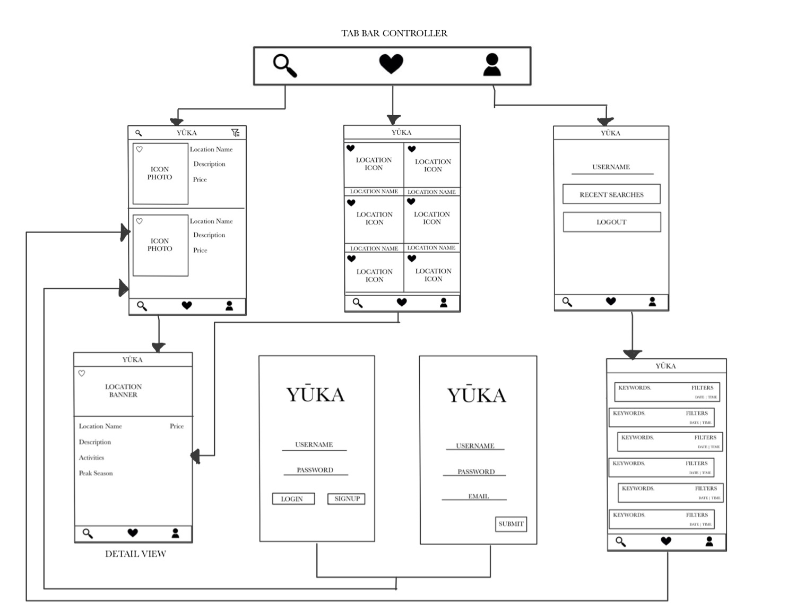

# Yuka

## Table of Contents
1. [Overview](#Overview)
1. [Product Spec](#Product-Spec)
1. [Wireframes](#Wireframes)

## Overview
### Description
Vacation planning app, allows user to input preferences and will curate a vacation to their liking.

### App Evaluation
- **Category:** Productivity / Social
- **Mobile:** This app would be primarily developed for mobile but would perhaps be just as viable on a computer, such as tinder or other similar apps. Functionality wouldn't be limited to mobile devices, however mobile version could potentially have more features.
- **Story:** Allows users to plan out their vacation using their preferences, and crafting their own experiences
- **Market:** Anyone that likes to travel enjoy this app. Ability to favorite based on interests and categories allows users with unique interests to engage in.
- **Habit:** This app could be used as often or unoften as the user wanted depending whether they want to just explore their surroundings on and off the trip. A "stay-cation" is an equal opportunity too.
- **Scope:** We plan to have the app start on the local level maybe even the national level, and then expand globally when we have investors and/or people tht would allow us access to their databases so we can include them.

## Product Spec
### 1. User Stories (Required and Optional)

**Required Must-have Stories**

* Users can log in or sign up
* User can view recommended locations to visit and enter detailed view when tapped
* User can save planned trips and start again after app is closed
* User can view favorites from a favorites fragment 
* Profile pages for each user
* User can see recent searches from their profile fragment

**Optional Nice-to-have Stories**

* User can leave reviews of places they visited or vacations they planned and taken
* Page of most visited trips or most favorited trips/locations
* Profile Add-On: settings page
* Allow users to interact with others on the same trip/ allow a private mode 
* Planning to go on a trip with other individuals and share contact information. 

### 2. Screen Archetypes

* Login 
* Register - User signs up or logs into their account
   * Upon Download/Reopening of the application, the user is prompted to log in to gain access to their profile information 
* Detail Screen 
   * Upon selecting location, user will be met with the location's name a small description and the price for the pre-planned vacation if vacation is made.
   * If it is an actual location then the location's name is displayed along with a small description, some activities that can be done, and the peak season when people travel there.
* Stream screen: 
    * Favorites:The locations/ vacations the user favorited will come up and you will beable to tap and get the detailed view of both
    * Recent searches: The user will be able to see the different searches they made along with the filters they included to get the results the user wanted 
* Profile Screen 
   * Allows user to upload a photo, view recent searches, and log out.
   
### 3. Navigation

**Tab Navigation** (Tab to Screen)

* Search
* Favorites
* Profile

Optional:
* Reviews
* Discover (Top Choices)

**Flow Navigation** (Screen to Screen)
* Forced Log-in -> Account creation if no log in is available
* Search  -> Detailed screen (-> to reviews if optional)
* Favorites  -> Detailed screen (-> to reviews if optional)
* Profile -> Searches (from Recent Searches) 

## Wireframes

